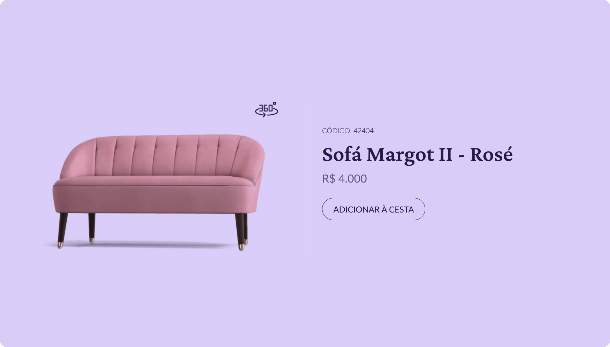

  

  

## 🖥️ Projeto
Esse é um projeto web no desafio do hora de codar, onde feito uma pagina web demonstrando a apresentação de um produto com animação, onde ao clicar no botão o produto 
fica de modo estático.

## 🚀 Tecnologias
Esse projeto foi desenvolvido durante o desafio #boracodar da Rocketsat com as seguintes tecnologias:

- HTML
- CSS
- JAVA SCRIPT
- GIT E GITHUB
- FIGMA

## 🏷️layout
Você pode visualizar o layout do projeto através 
[desse link](https://www.figma.com/file/6NPyslzjo7ciYDxDarcTwq/Card-de-Produto-%E2%80%A2-Desafio-02-(Community)?node-id=0%3A1&mode=dev).
É necessario ter uma conta no [Figma](https://www.figma.com).